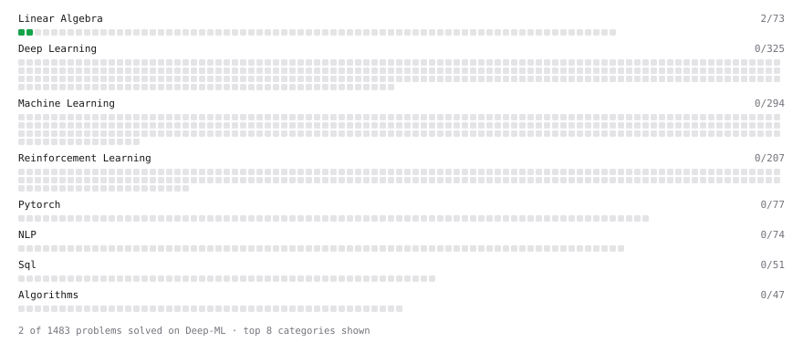

# Deep-ML

My machine learning practice from [Deep-ML](https://www.deep-ml.com). Every solution here was written by hand.

**7** solved · 7 problems · 0 labs · 0 math

[**Browse the interactive portfolio**](https://samehnadeem7.github.io/deep-ml/) to replay this filling in over time.

## Problems

| | Difficulty | Solved | |
| --- | --- | --- | --- |
| [Calculate 2x2 Matrix Inverse](https://www.deep-ml.com/problems/8) | easy | 2026-10-01 | [solution](problems/0008-calculate-2x2-matrix-inverse) |
| [Calculate Cosine Similarity Between Vectors](https://www.deep-ml.com/problems/76) | easy | 2026-09-30 | [solution](problems/0076-calculate-cosine-similarity-between-vectors) |
| [Dot Product Calculator](https://www.deep-ml.com/problems/83) | easy | 2026-09-30 | [solution](problems/0083-dot-product-calculator) |
| [Matrix-Vector Dot Product](https://www.deep-ml.com/problems/1) | easy | 2026-09-30 | [solution](problems/0001-matrix-vector-dot-product) |
| [Scalar Multiplication of a Matrix](https://www.deep-ml.com/problems/5) | easy | 2026-09-30 | [solution](problems/0005-scalar-multiplication-of-a-matrix) |
| [Transpose of a Matrix](https://www.deep-ml.com/problems/2) | easy | 2026-09-30 | [solution](problems/0002-transpose-of-a-matrix) |
| [Calculate Eigenvalues of a Matrix](https://www.deep-ml.com/problems/6) | medium | 2026-10-01 | [solution](problems/0006-calculate-eigenvalues-of-a-matrix) |

---

_This file is regenerated by Deep-ML on every push._
